# 真实仿真相册

以下 15 张图片来自本项目的独立重置运行，原始 PNG 与压缩 JPG 均为 1920×1080。每张 JSON 保存实际相机、时间、运行编号、任务状态和逐张视觉复核结果。

地面任务失败不称为导航通过。RViz 蓝色线保留首条真实 FAR 图路径，属于历史显示，可能已被取消；控制仍执行原话题的取消和过期规则。

丘陵首轮因定位过期未获得可渲染路径，因此使用同一镜像、同一实现的一次额外独立运行补拍 RViz。补拍不替换失败记录，也不加入九组合的 27 次统计。

[完整结果与日志](evidence/README.md) · [JSON](evidence/candidate-matrix/matrix_results.json) · [CSV](evidence/candidate-matrix/matrix_results.csv)

| 场地 | Jackal J100 | Husky A200 | X500 |
| --- | --- | --- | --- |
| 玉米田 | fail × 3 | fail × 3 | pass × 3 |
| 果园 | fail × 3 | fail × 3 | pass × 3 |
| 丘陵 | fail × 3 | fail × 3 | fail × 1，pass × 2 |

## 玉米田

### Jackal J100 · 任务图 · fail

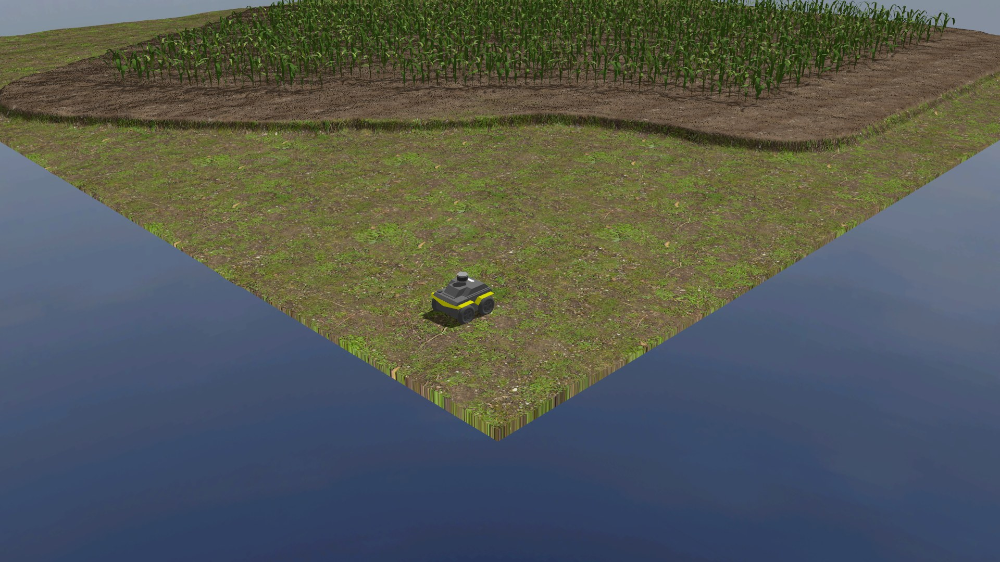

[原始 PNG](maize_field_jackal_j100_r1_task.png) · [元数据](maize_field_jackal_j100_r1_task.json) · [运行结果](evidence/candidate-matrix/maize_field_jackal_j100_r1.json)

### Jackal J100 · 全景 · fail

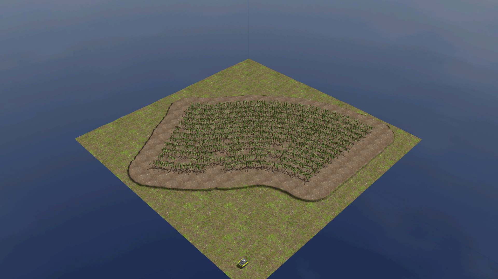

[原始 PNG](maize_field_jackal_j100_r1_panorama.png) · [元数据](maize_field_jackal_j100_r1_panorama.json) · [运行结果](evidence/candidate-matrix/maize_field_jackal_j100_r1.json)

### Jackal J100 · RViz · fail

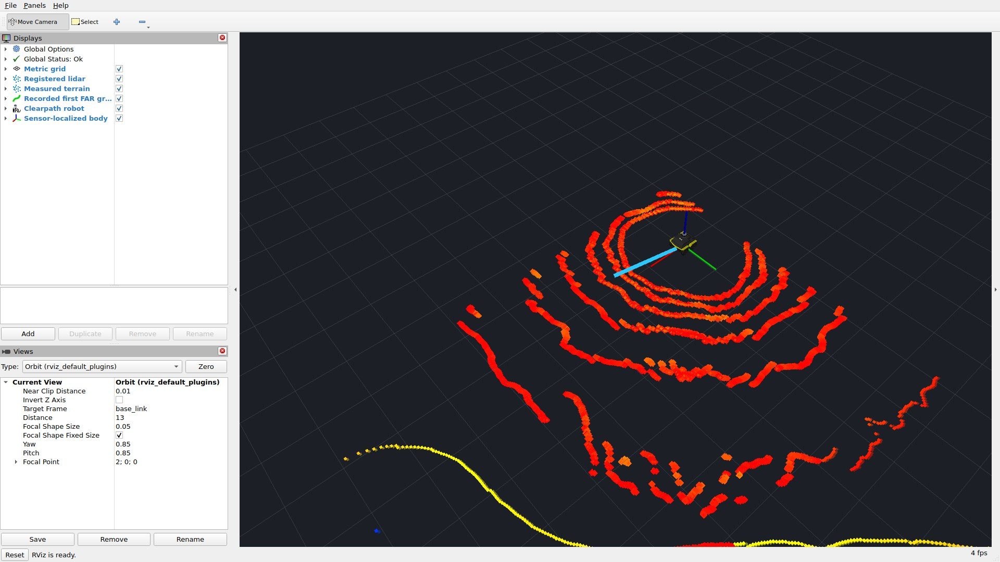

[原始 PNG](maize_field_jackal_j100_r1_rviz.png) · [元数据](maize_field_jackal_j100_r1_rviz.json) · [运行结果](evidence/candidate-matrix/maize_field_jackal_j100_r1.json)

### Husky A200 · 任务图 · fail

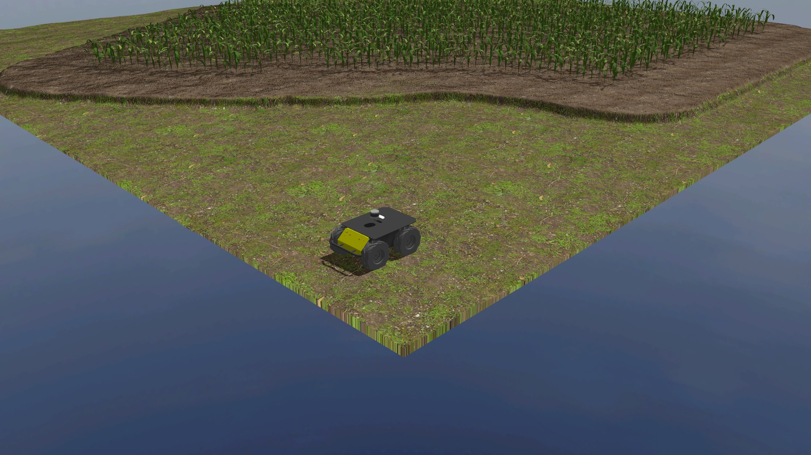

[原始 PNG](maize_field_husky_a200_r1_task.png) · [元数据](maize_field_husky_a200_r1_task.json) · [运行结果](evidence/candidate-matrix/maize_field_husky_a200_r1.json)

### X500 · 任务图 · pass

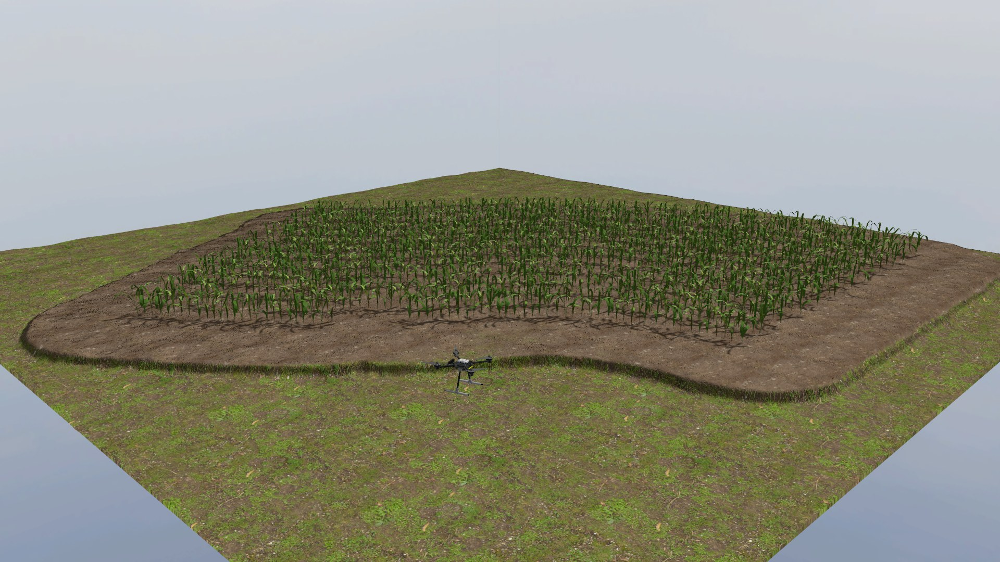

[原始 PNG](maize_field_x500_r1_task.png) · [元数据](maize_field_x500_r1_task.json) · [运行结果](evidence/candidate-matrix/maize_field_x500_r1.json)

## 果园

### Jackal J100 · 任务图 · fail

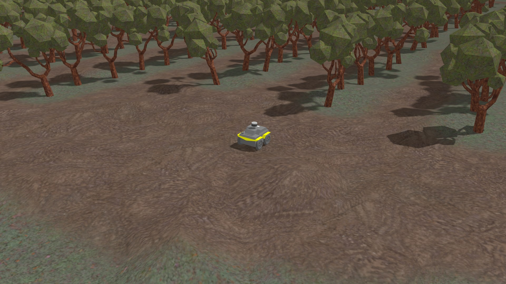

[原始 PNG](orchard_jackal_j100_r1_task.png) · [元数据](orchard_jackal_j100_r1_task.json) · [运行结果](evidence/candidate-matrix/orchard_jackal_j100_r1.json)

### Jackal J100 · 全景 · fail

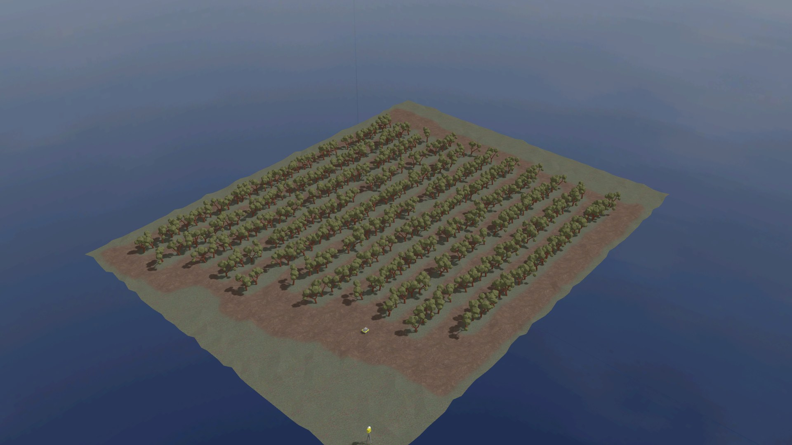

[原始 PNG](orchard_jackal_j100_r1_panorama.png) · [元数据](orchard_jackal_j100_r1_panorama.json) · [运行结果](evidence/candidate-matrix/orchard_jackal_j100_r1.json)

### Jackal J100 · RViz · fail

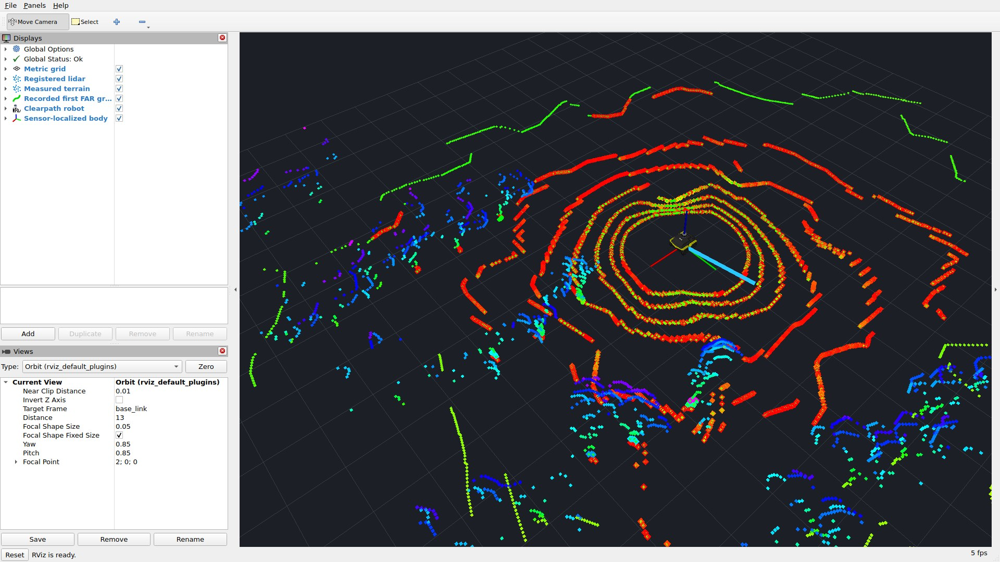

[原始 PNG](orchard_jackal_j100_r1_rviz.png) · [元数据](orchard_jackal_j100_r1_rviz.json) · [运行结果](evidence/candidate-matrix/orchard_jackal_j100_r1.json)

### Husky A200 · 任务图 · fail

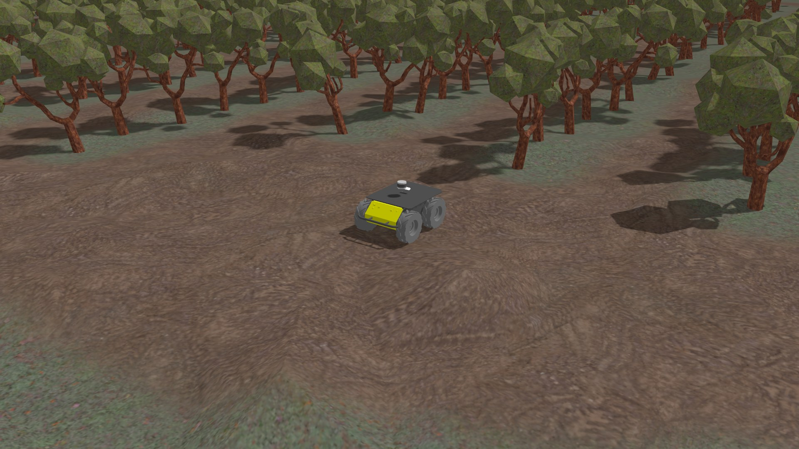

[原始 PNG](orchard_husky_a200_r1_task.png) · [元数据](orchard_husky_a200_r1_task.json) · [运行结果](evidence/candidate-matrix/orchard_husky_a200_r1.json)

### X500 · 任务图 · pass

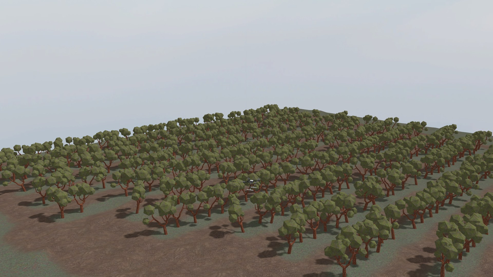

[原始 PNG](orchard_x500_r1_task.png) · [元数据](orchard_x500_r1_task.json) · [运行结果](evidence/candidate-matrix/orchard_x500_r1.json)

## 丘陵

### Jackal J100 · 任务图 · fail

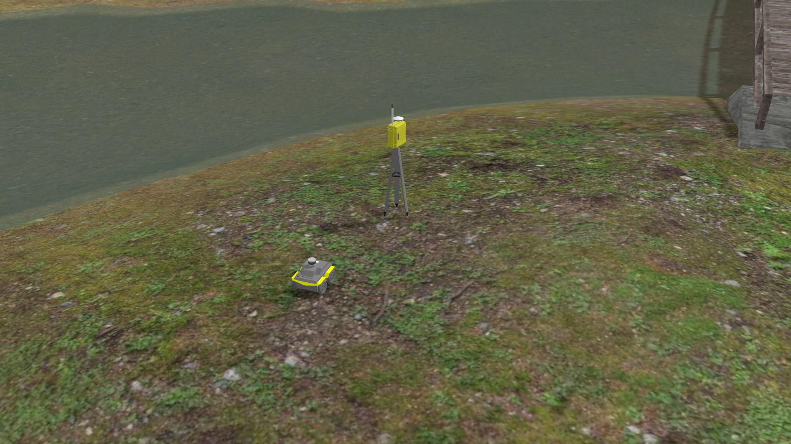

[原始 PNG](pipeline_jackal_j100_r1_task.png) · [元数据](pipeline_jackal_j100_r1_task.json) · [运行结果](evidence/candidate-matrix/pipeline_jackal_j100_r1.json)

### Jackal J100 · 全景 · fail

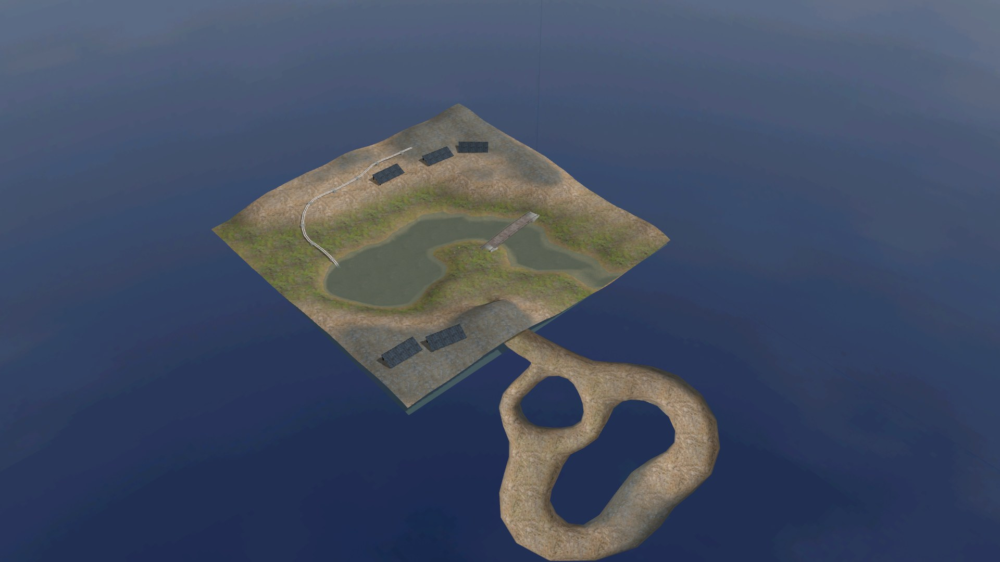

[原始 PNG](pipeline_jackal_j100_r1_panorama.png) · [元数据](pipeline_jackal_j100_r1_panorama.json) · [运行结果](evidence/candidate-matrix/pipeline_jackal_j100_r1.json)

### Jackal J100 · RViz · fail

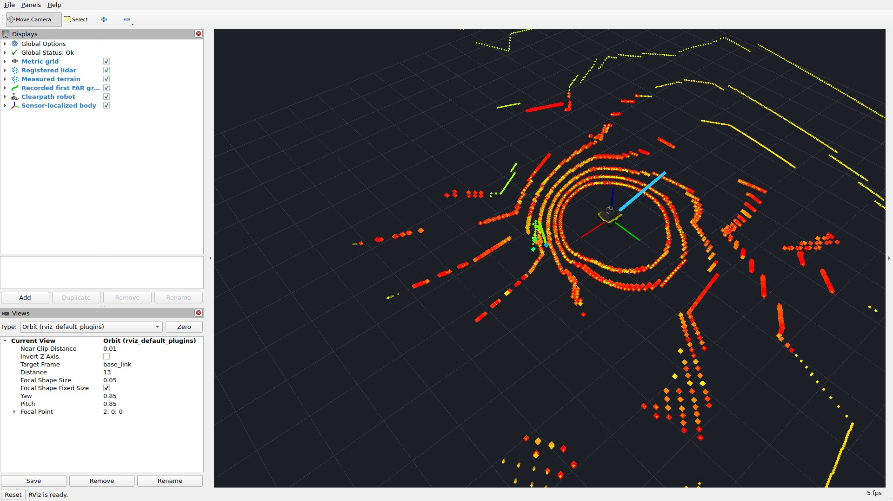

[原始 PNG](pipeline_jackal_j100_rviz_retry_rviz.png) · [元数据](pipeline_jackal_j100_rviz_retry_rviz.json) · [运行结果](evidence/capture-supplement/pipeline_jackal_j100_rviz_retry.json)

### Husky A200 · 任务图 · fail

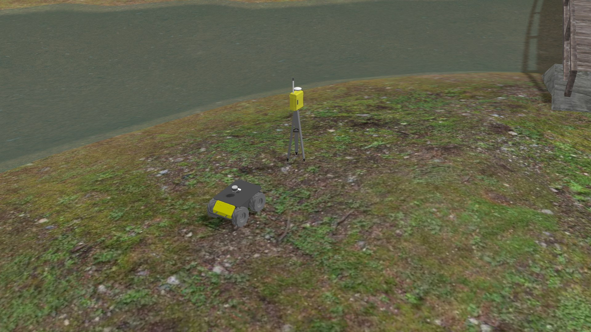

[原始 PNG](pipeline_husky_a200_r1_task.png) · [元数据](pipeline_husky_a200_r1_task.json) · [运行结果](evidence/candidate-matrix/pipeline_husky_a200_r1.json)

### X500 · 任务图 · pass

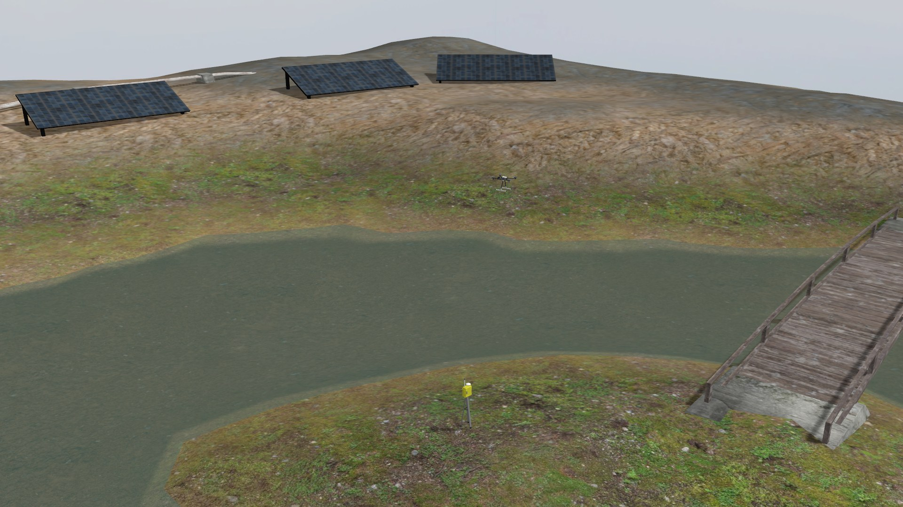

[原始 PNG](pipeline_x500_r1_task.png) · [元数据](pipeline_x500_r1_task.json) · [运行结果](evidence/candidate-matrix/pipeline_x500_r1.json)
